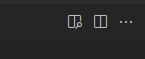
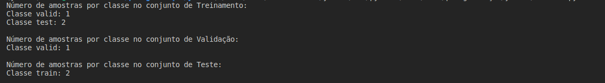
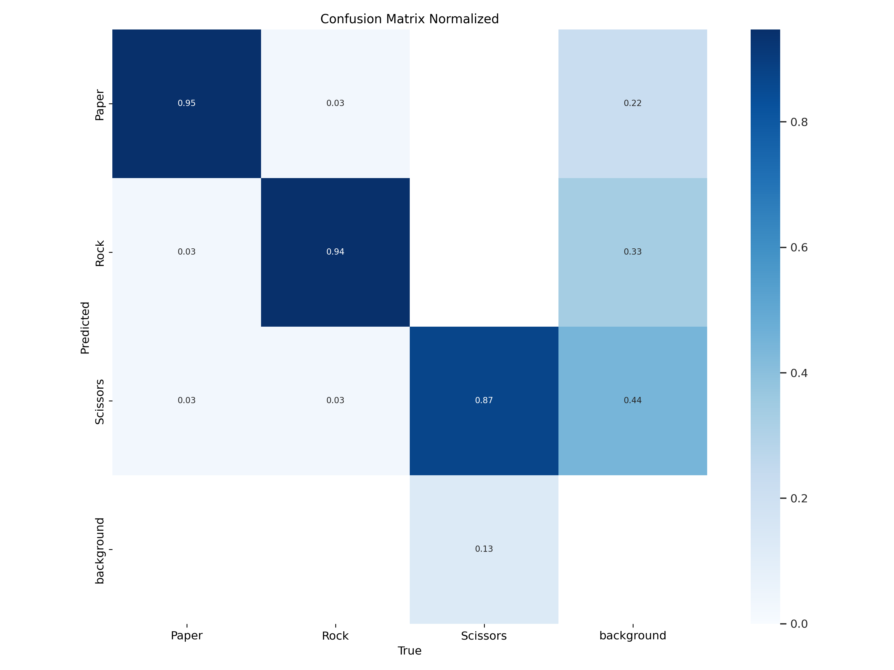
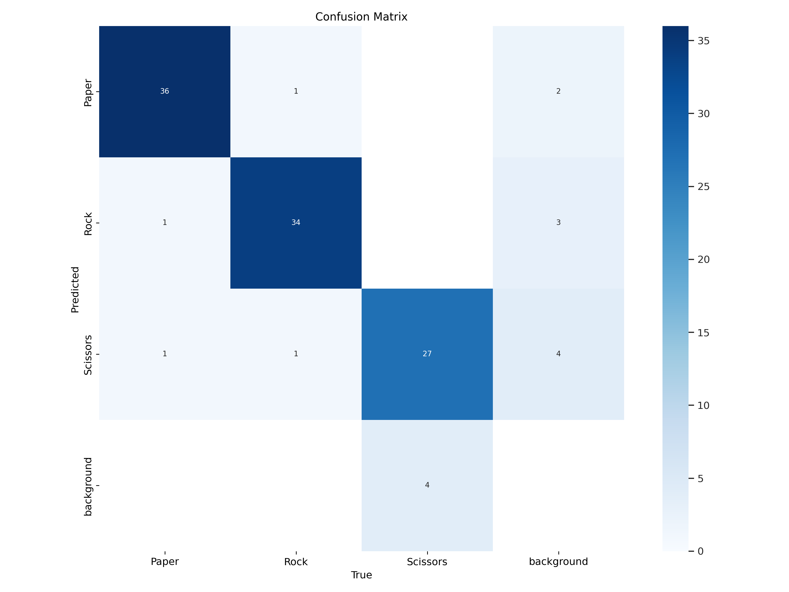
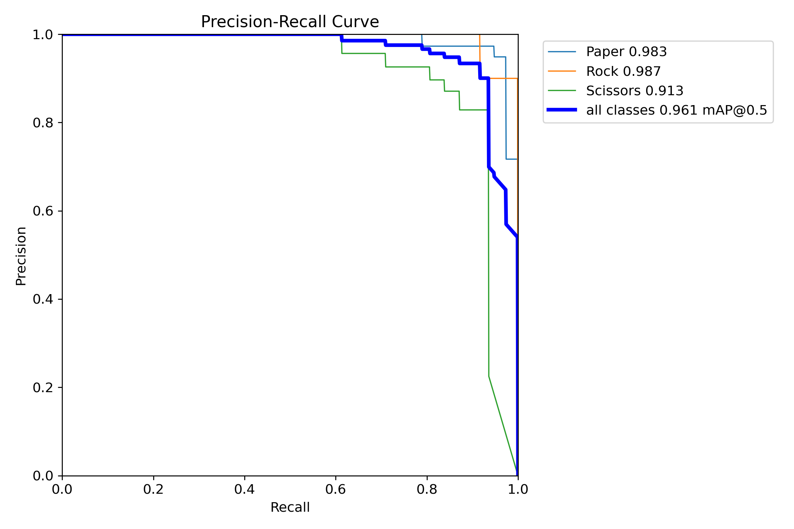
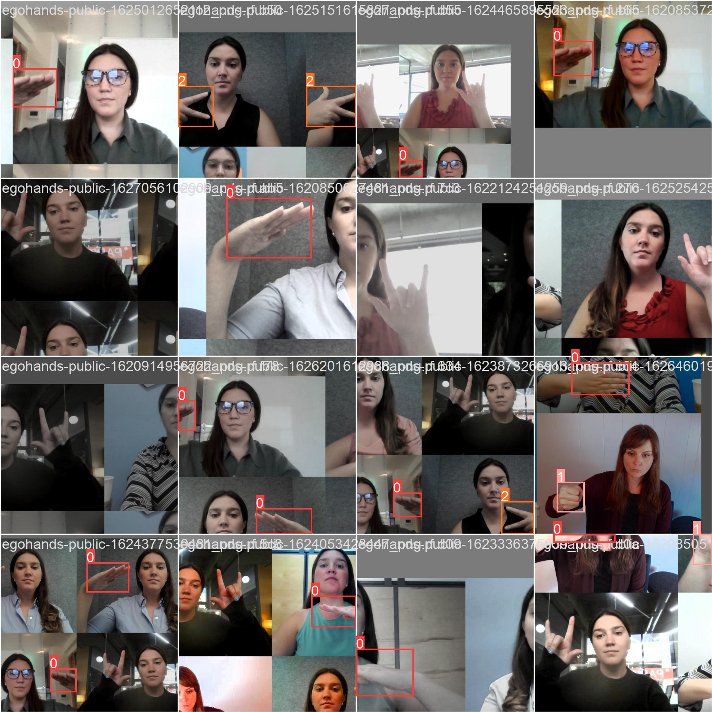

# 
 Yolov8 pedra papel tesoura  

## 
 Observações

* Para visualizar documento completo e formatado clicar no icone com lupa 
* O modelo teve mais treinamentos todos na pasta runs/detect/
* Os vídeos de demonstração da rede estão na pasta pos-graduação yolov8/imgs/videoTest.avi
* O script dataset.py referece a separação do dataset
* O script yolov8.py referece a execução do modelo em video ou real-time

# 
 Resultado da estratificação de dataset

   

# 
 Paramêtros utilizados no treinamento

yolo detect train data=data_paper.yaml model=yolov8m.yaml epochs=150 imgsz=640 degrees=0.0 translate=0.1 scale=0.5 flipud=0.0 mosaic=1.0 profile=True shear=0.0 perspective=0.0 cos_lr=True resume=True

yolo detect train data=data_paper.yaml model=yolov8m.yaml epochs=200 imgsz=640 degrees=0.0 translate=0.1 scale=0.5 flipud=0.0 mosaic=1.0 profile=True shear=0.0 perspective=0.0 cos_lr=True resume=True

exportação: yolo export model=best.pt format=onnx

# 
 Resultados da melhor rede treinada

   

   

   

   

# 
 Exibição de resultados em vídeo

 <video controls width="500">
    <source src="imgs/videoTest.mp4" type="video/mp4">
    Seu navegador não suporta a reprodução de vídeo.
</video> 

